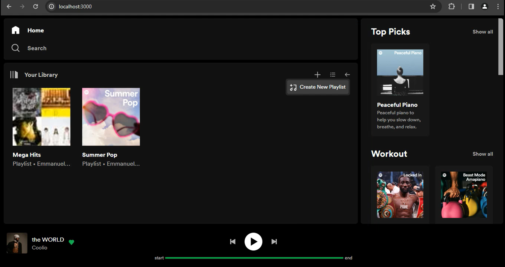
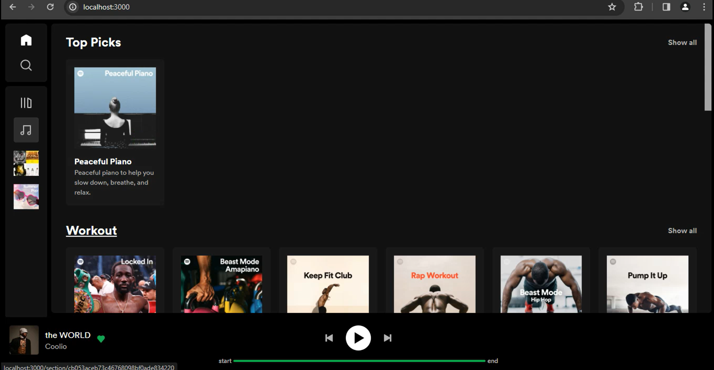
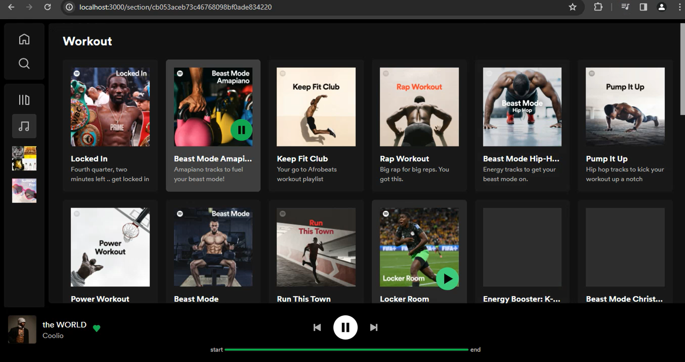

This project is a spotify-clone I built for practice. It is not in anyway used for commercial purposes or attempts to impersonate the original **Spotify** company. 

## Getting Started
- Download the starter code included in this repository.
- Download the starter code for the [backend](https://github.com/Emmanuetoks/spotify-clone-backend). The backend is required in order to fetch the data that will be displayed in the website.
- Run the code in both the frontend and the backend by executing```npm run dev``` in the terminal.

## How it Works
The website was inspired from the [spotify music player](https://open.spotify.com) and works almost the same. You can create playlists by clicking on the add button in the **Your Library** section. This will create a new temporary playlist which bis not saved in the database. 

Only the homepage includes a list of playlists linked to a playlist page that shows detailed information about each particular playlist.

The play button on each spotify playlist play the first song on each playlist

The website has a web player that i built which works in tandem with the green button on each playlist card.

## Video on how it works

*Note: You will have to download the video.*

## Screenshots
- 
- 
- 


